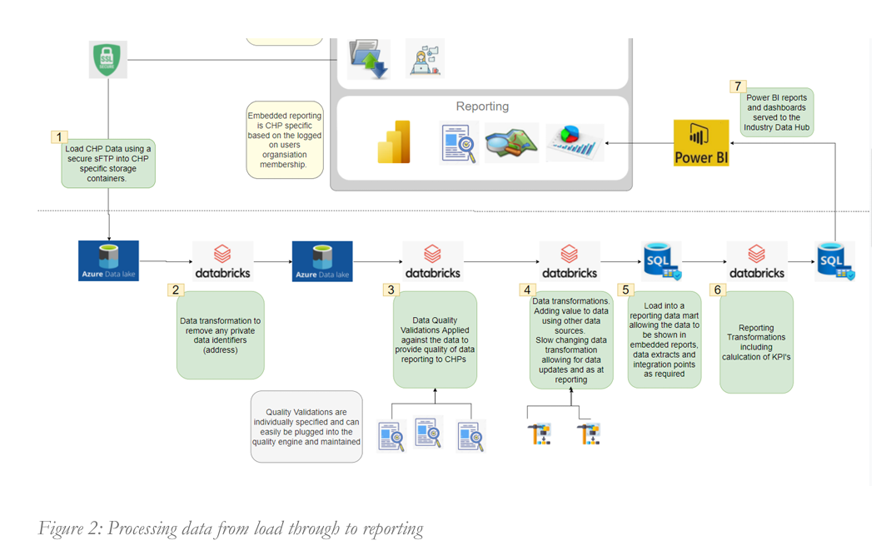

# Introduction 
Designed and implemented a centralized data warehouse to streamline data management and reporting for a community housing company. The project involved collecting, transforming, and storing data from various sources, enabling efficient data analysis and visualization.

# Step By Step

# Result

# Contribute
* **An Pham** - Data Engineer - [AnNePDHA](https://github.com/AnNePDHA)
  * Collected and processed CSV and Excel files from a web application using Databricks and Azure Storage Account, improving data integration efficiency.
  * Developed ETL pipelines using Python and Databricks to extract, transform, and load data into Microsoft SQL Server, ensuring data accuracy and consistency.
  * Enabled users to define and manage tables in Microsoft SQL Server, ensuring a structured and scalable data storage solution.
  * Maintained the entire system, ensuring data reliability and system performance.
